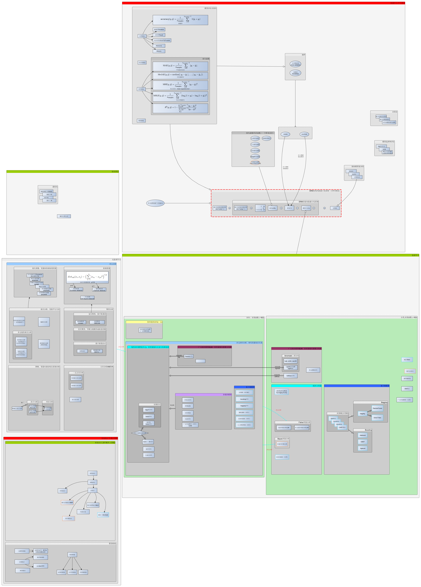
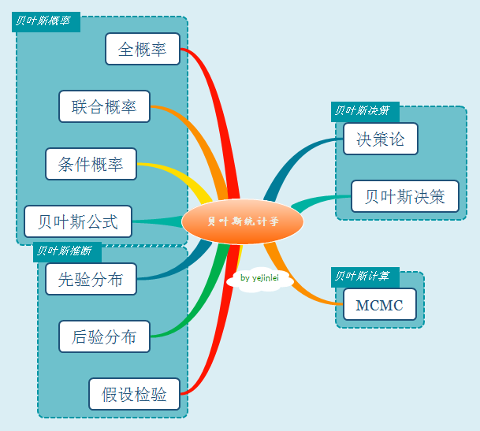

# about-ml 有关机器学习

----------

## 数学基础

## 机器学习

## 深度学习

----------

## 微积分

## 线性代数

## 统计学

## 运筹学（operations Research，简称OP）及最优化
*1. 一般的运筹学模型，可以使用下面通用格式：*

    max或min 目标函数
    s.t.	 约束条件
*一个模型的解如果满足所有的约束条件，则称它是可行的(feasible);同时目标函数取得了最大或最小值，则称它是最优的(optimal)* 

*2. 运筹学的主要步骤：*
	
- 问题定义
- 模型构造
- 模型求解
- 模型验证
- 方案实施 

*3. 没有万能的数学模型可以描述现实中所有问题，同样也没有万能技术、方法可以求解所有数学模型；*

*4. 运筹学的的一个特点就是，问题的解往往不是通过解析式获得，而是利用某些算法或迭代计算，逐步逼近最优解的过程；*

*5. 计算量往往会随着模型复杂度而增加，有时为了减少计算量而简化数学模型来获得次优解*

### **线性规划**（linear programming，简称LP）★
*1. LP问题，带有线性目标函数和线性约束函数的模型*

*2. LP的最优解，总是发生在角点处，这意味着最优解能够简单通过枚举所有角点来找到；随着约束条件和变量的增加，角点个数也在增加，计算量会逐渐变大；*

##### 1、图解法（graphical method）
- 可行解空间的确定；
- 从可行解空间所有可行点中确定最优解；

##### 2、单纯形法（simplex method）

----------

## 统计学习和机器学习
### 统计学
#### 参数估计 
#### 假设检验
    假设检验是除参数估计之外的另一类重要的统计推断问题，采用的逻辑推理方法是反证法，它的基
    本思想可以用小概率原理来解释。所谓小概率原理，就是认为小概率事件在一次实验中是几乎不可
    能发生的。
	
    在统计假设检验中，首先要对总体分布参数设定一个假设（零假设H0），然后从总体分布中抽样，
    通过样本计算所得的统计量来对总体参数进行推断。假定零假设为真，如果计算获得观测样本的统
    计量的概率非常小，便可以拒绝原假设，接受它的对立面（称作备择假设或者研究假设H1）。

- 显著性检验，是“统计假设检验”（Statistical hypothesis testing）的一种，显著性检验是用于检测科学实验中实验组与对照组之间是否有差异以及差异是否显著的办法。
	- 显著性水平α
	- p-value

### 一、多元分析

#### 相关分析
##### 相关系数
    相关系数可以用来描述定量变量之间的关系。相关系数的符号（+/-）表明关系的方向
	（正相关或负相关），其值的大小表示关系的强弱程度（完全不相关时为0，完全相关时为1）
- 相关类型
	- Pearson积差相关系数衡量了两个定量变量之间的线性相关程度。计算公式如下，
		
		

	- Spearman等级相关系数则衡量分级定序变量之间的相关程度
	- Kendall’s Tau相关系数也是一种非参数的等级相关度量

##### 协方差

##### 1、简单线性相关分析

#### 聚类分析
##### 1、k-means均值聚类分析

#### 方差分析
##### 1、简单方差分析
##### 2、协方差分析

#### 降维方法
##### 1、PCA主成分分析
##### 2、因子分析
##### 3、对应分析

#### 回归分析
##### 1、简单线性回归

	#R语言片段
	x <- c(151,174,138,186,128,136,179,163,152,131)
	y <- c(63,81,56,91,47,57,76,72,62,48)
	model <- lm(y~x)
	summary(model)
	
	plot(y,x,col = "red") #原始数据散点图
	abline(model)         #绘制拟合直线
    plot(model)           #绘制残差图、QQ图等诊断图

	Call:
	lm(formula = y ~ x)
	
	Residuals:
	Min  1Q  Median  3Q Max 
	-6.3002 -1.6629  0.0412  1.8944  3.9775 
	
	Coefficients:
	 Estimate        Std. Error   t value  Pr(>|t|)
	(Intercept) -38.455098.04901  -4.778   0.00139 ** 
	     x        0.674610.05191  12.997   1.16e-06 ***
	---
	Signif. codes:  0 ‘***’ 0.001 ‘**’ 0.01 ‘*’ 0.05 ‘.’ 0.1 ‘ ’ 1
	
	Residual standard error: 3.253 on 8 degrees of freedom
	Multiple R-squared:  0.9548,	Adjusted R-squared:  0.9491 
	F-statistic: 168.9 on 1 and 8 DF,  p-value: 1.164e-06

- Residuals残差
- Coefficients回归系数
- Residual standard error拟合优度R^2
- Residuals vs Fitted Plot（残差图）：横坐标为拟合的方程中Y值，纵坐标为残差值。拟合曲线越接近0，则代表拟合的函数和样本点之间的误差就越小，模型越好。
- Normal Q-Q Plot：横坐标为标准正态分布的分位数，纵坐标为样本值。通过Q-Q图上的点是否近似地在一条直线附近，用于鉴别样本数据是否近似于正态分布。而且该直线的斜率为标准差,截距为均值。
- Scale-Location Plot（标准化残差开方与拟合值的残差图）
- Residuals vs Leverage（学生化残差值与杠杆值图）

##### 2、多元线性回归
##### 3、广义线性模型