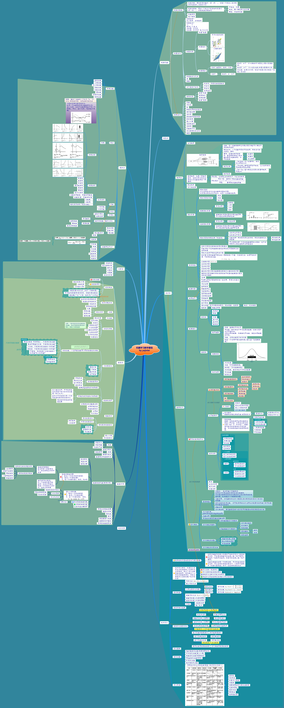
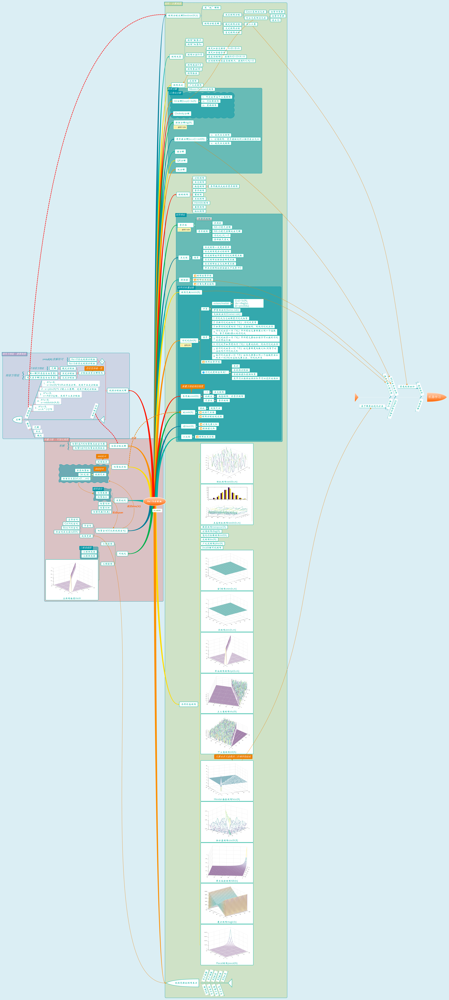
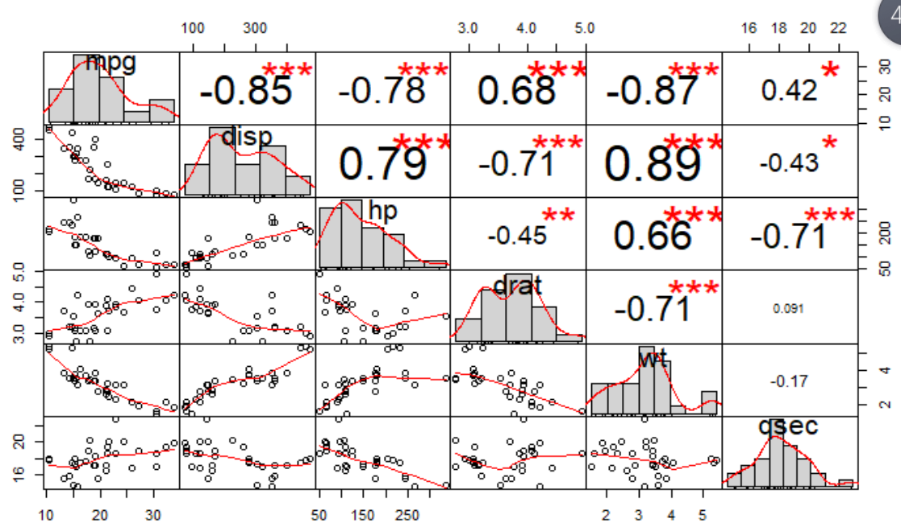
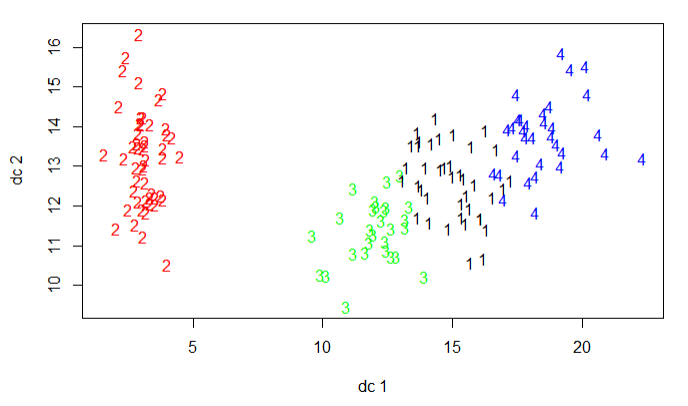
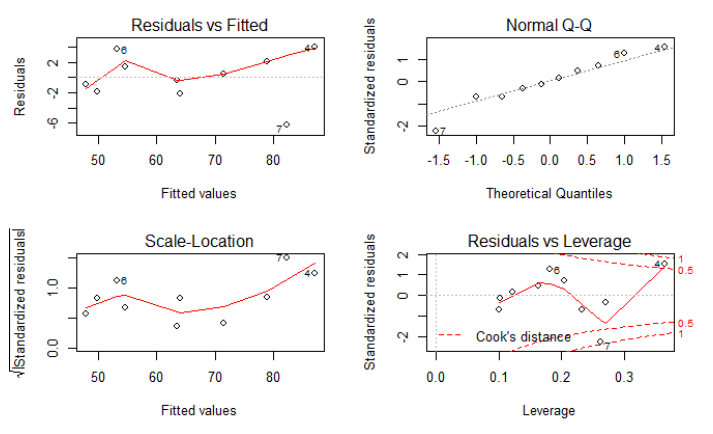

# about-ml 有关机器学习

----------

## 数学基础汇总

## 微积分

## 线性代数

## 概率论和统计学

## 最优化
*1. 一般的运筹学模型，可以使用下面通用格式：*

    max或min 目标函数
    s.t.	 约束条件
*一个模型的解如果满足所有的约束条件，则称它是可行的(feasible);同时目标函数取得了最大或最小值，则称它是最优的(optimal)* 

*2. 运筹学的主要步骤：*
	
- 问题定义
- 模型构造
- 模型求解
- 模型验证
- 方案实施 

*3. 没有万能的数学模型可以描述现实中所有问题，同样也没有万能技术、方法可以求解所有数学模型；*

*4. 运筹学的的一个特点就是，问题的解往往不是通过解析式获得，而是利用某些算法或迭代计算，逐步逼近最优解的过程；*

*5. 计算量往往会随着模型复杂度而增加，有时为了减少计算量而简化数学模型来获得次优解*

### **线性规划**（linear programming，简称LP）★
*1. LP问题，带有线性目标函数和线性约束函数的模型*

*2. LP的最优解，总是发生在角点处，这意味着最优解能够简单通过枚举所有角点来找到；随着约束条件和变量的增加，角点个数也在增加，计算量会逐渐变大；*

##### 1、图解法（graphical method）
- 可行解空间的确定；
- 从可行解空间所有可行点中确定最优解；

##### 2、单纯形法（simplex method）

----------

## 统计学习和机器学习

### 参数估计 
### 假设检验
    假设检验是除参数估计之外的另一类重要的统计推断问题，采用的逻辑推理方法是反证法，它的基
    本思想可以用小概率原理来解释。所谓小概率原理，就是认为小概率事件在一次实验中是几乎不可
    能发生的。
	
    在统计假设检验中，首先要对总体分布参数设定一个假设（零假设H0），然后从总体分布中抽样，
    通过样本计算所得的统计量来对总体参数进行推断。假定零假设为真，如果计算获得观测样本的统
    计量的概率非常小，便可以拒绝原假设，接受它的对立面（称作备择假设或者研究假设H1）。

- 显著性检验，是“统计假设检验”（Statistical hypothesis testing）的一种，显著性检验是用于检测科学实验中实验组与对照组之间是否有差异以及差异是否显著的办法。
	- 显著性水平α
	- p-value

### 一、多元分析

#### 相关分析
##### 相关系数
    相关系数可以用来描述定量变量之间的关系。相关系数的符号（+/-）表明关系的方向
	（正相关或负相关），其值的大小表示关系的强弱程度（完全不相关时为0，完全相关时为1）
- 相关类型
	- Pearson积差相关系数衡量了两个定量变量之间的线性相关程度。计算公式如下，
		
		

	- Spearman等级相关系数则衡量分级定序变量之间的相关程度
	- Kendall’s Tau相关系数也是一种非参数的等级相关度量

##### 1、简单线性相关分析

	#R语言片段
	data("mtcars") #加载32种不同品牌的轿车
	mydata <- mtcars[, c(1,3,4,5,6,7)]
	head(mydata, 6)
	
	res <- cor(mydata)
	round(res, 2);res
	print("--------")
	library(Hmisc)
	res2 <- rcorr(as.matrix(mydata));res2
	
	library(PerformanceAnalytics)
	chart.Correlation(mydata, histogram=TRUE, pch=19)

	       mpg  disp    hp  drat    wt  qsec
	mpg   1.00 -0.85 -0.78  0.68 -0.87  0.42
	disp -0.85  1.00  0.79 -0.71  0.89 -0.43
	hp   -0.78  0.79  1.00 -0.45  0.66 -0.71
	drat  0.68 -0.71 -0.45  1.00 -0.71  0.09
	wt   -0.87  0.89  0.66 -0.71  1.00 -0.17
	qsec  0.42 -0.43 -0.71  0.09 -0.17  1.00
	            mpg       disp         hp        drat         wt        qsec
	mpg   1.0000000 -0.8475514 -0.7761684  0.68117191 -0.8676594  0.41868403
	disp -0.8475514  1.0000000  0.7909486 -0.71021393  0.8879799 -0.43369788
	hp   -0.7761684  0.7909486  1.0000000 -0.44875912  0.6587479 -0.70822339
	drat  0.6811719 -0.7102139 -0.4487591  1.00000000 -0.7124406  0.09120476
	wt   -0.8676594  0.8879799  0.6587479 -0.71244065  1.0000000 -0.17471588
	qsec  0.4186840 -0.4336979 -0.7082234  0.09120476 -0.1747159  1.00000000
	[1] "--------"
	       mpg  disp    hp  drat    wt  qsec
	mpg   1.00 -0.85 -0.78  0.68 -0.87  0.42
	disp -0.85  1.00  0.79 -0.71  0.89 -0.43
	hp   -0.78  0.79  1.00 -0.45  0.66 -0.71
	drat  0.68 -0.71 -0.45  1.00 -0.71  0.09
	wt   -0.87  0.89  0.66 -0.71  1.00 -0.17
	qsec  0.42 -0.43 -0.71  0.09 -0.17  1.00
	
	n= 32 

	
*对角线上显示的是分布图*

*左下部显示的是具有拟合线的双变量散点图*

*右上部显示的是相关系数以及显著性水平*

#### 聚类分析
	聚类分析是研究“物以类聚”的一种现代统计分析方法。
    聚类分析的目的是把分类对象按一定规则分成若干类，这些类不是实现设定的，而是更具数据的特征确定的。
	聚类分析的基本原则是将有较大相似性(距离、相似系数)的对象归为同一类，而将差异较大的个体归入不同的类。

##### 1、k-means均值聚类分析
K-means算法是很典型的基于距离的聚类算法，采用距离作为相似性的评价指标，即认为两个对象的距离越近，其相似度就越大。该算法认为簇是由距离靠近的对象组成的，因此把得到紧凑且独立的簇作为最终目标。K-means算法流程：
	
1、选取k个初始质心（初始质心的选取对聚类结果影响比较大）

2、比较新老质心，小于阈值停止，否则继续循环如下：

3、剩余样本分配到最近的质心（采用欧氏距离）

4、重新计算新的质心（采用样本均值）
	
	#R语言片段
	library(fpc)
	data(iris)
	df<-iris[,c(1:4)]
	set.seed(252964)          # k-means对初始质心比较敏感
	kmeans <- kmeans(na.omit(df), 4)    # K-means均值聚类
	plotcluster(na.omit(df), kmeans$cluster) # 生成聚类图

#### 方差分析
##### 1、简单方差分析
##### 2、协方差分析

#### 降维方法
##### 1、PCA主成分分析
##### 2、因子分析
##### 3、对应分析

#### 回归分析
##### 1、简单线性回归

	#R语言片段
	x <- c(151,174,138,186,128,136,179,163,152,131)
	y <- c(63,81,56,91,47,57,76,72,62,48)
	model <- lm(y~x)
	summary(model)
	
	plot(y,x,col = "red") #原始数据散点图
	abline(model)         #绘制拟合直线
    plot(model)           #绘制残差图、QQ图等诊断图

	Call:
	lm(formula = y ~ x)
	
	Residuals:
	Min  1Q  Median  3Q Max 
	-6.3002 -1.6629  0.0412  1.8944  3.9775 
	
	Coefficients:
	              Estimate       Std. Error   t value  Pr(>|t|)
	(Intercept)   -38.45509        8.04901     -4.778  0.00139 ** 
	     x          0.67461        0.05191     12.997  1.16e-06 ***
	---
	Signif. codes:  0 ‘***’ 0.001 ‘**’ 0.01 ‘*’ 0.05 ‘.’ 0.1 ‘ ’ 1
	
	Residual standard error: 3.253 on 8 degrees of freedom
	Multiple R-squared:  0.9548,	Adjusted R-squared:  0.9491 
	F-statistic: 168.9 on 1 and 8 DF,  p-value: 1.164e-06

- Residuals（残差）：残差在数理统计中是指实际观察值与估计值（拟合值）之间的差。“残差”蕴含了有关模型基本假设的重要信息。
- Coefficients（回归系数）:Intercept代表截距，回归系数为Estimate列
- Residual standard error（拟合优度R^2）:是指回归直线对观测值的拟合程度。度量拟合优度的统计量是可决系数（亦称确定系数）R²。R²最大值为1。R²的值越接近1，说明回归直线对观测值的拟合程度越好；反之，R²的值越小，说明回归直线对观测值的拟合程度越差。
	
	

	

- 普通残差与拟合值的残差图：估计观察或预测到的误差error(残差residuals)与随机误差(stochastic error)是否一致。横坐标为拟合的方程中Y值，纵坐标为残差值。拟合曲线越接近0，则代表拟合的函数和样本点之间的误差就越小，模型越好。
- 正态QQ的残差图：横坐标为标准正态分布的分位数，纵坐标为样本值。通过Q-Q图上的点是否近似地在一条直线附近，用于鉴别样本数据是否近似于正态分布。而且该直线的斜率为标准差,截距为均值。
- 标准化残差开方与拟合值的残差图:
- cook统计量的残差图:

##### 2、多元线性回归

##### 3、广义线性模型
	在线性回归模型中的假设中，有两点需要提出：
	（1）假设因变量服从高斯分布：Y=θTx+ξ，其中误差项ξ∼N(0,σ2)，那么因变量Y∼N(θTx,σ2)。　　
	（2）模型预测的输出为E[Y]，根据Y=θTx+ξ，E[Y]=E[θTx+ξ]=θTx，记η=θTx，则η=E[Y]
	广义线性模型可以认为在以上两点假设做了扩展：
	（1）因变量分布不一定是高斯分布，服从一个指数分布族(见下文)即可。
	（2）模型预测输出仍然可以认为是E[Y]（实际上是E[T(Y)]，许多情况下T(Y)=Y），但是Y的分布不一定是高斯分布，E[Y]和η=θTx也不一定是简单的相等关系，它们的关系用η=g(E[Y])描述，称为连接函数，其中η称为自然参数。
	由于以上两点的扩展，广义线性模型的应用比基本线性模型广泛许多。对于广义线性这个术语，可以理解为广义体现在因变量的分布形式比较广，只要是一指数分布族即可，而线性则体现在自然参数η=θTx是θ的线性函数。

----------

## 深度学习

* **深度学习思维导图**

* **深度学习中的优化算法**
